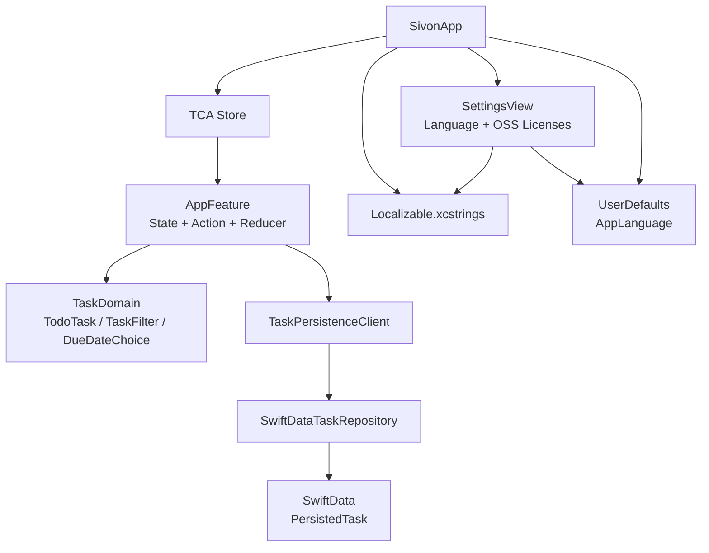
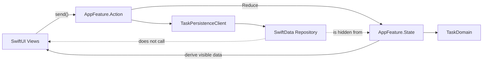

# Sivon Architecture

## 目的

このドキュメントは、Sivon の現在のアーキテクチャ判断を記録する。仕様の詳細は `docs/SPEC.md` を正とし、この文書では実装上の責務分離、依存関係、今後変更する際の注意点を扱う。

## 現在の構成

Sivon は macOS 14+ 向けの SwiftUI アプリで、状態管理に The Composable Architecture (TCA)、ローカル永続化に SwiftData を使う。

主要ファイル:

- `Sources/Sivon/SivonApp.swift`: アプリのエントリーポイント、SwiftData `ModelContainer`、TCA `Store`、Settings scene を構成する。
- `Sources/Sivon/AppFeature.swift`: タスク一覧、選択ビュー、選択タスク、作成・編集・削除・保存エラーをまとめて扱う reducer。
- `Sources/Sivon/TaskDomain.swift`: タスクのドメイン型、フィルタ、日付選択、表示対象タスクの導出ロジック。
- `Sources/Sivon/Persistence.swift`: SwiftData モデルと永続化クライアント。
- `Sources/Sivon/*View.swift`: SwiftUI の表示層。



## 判断

MVP では feature を細かく分割せず、`AppFeature` を単一の状態管理単位にする。

理由:

- タスクのソースオブトゥルースは単一配列であり、サイドバー、一覧、詳細が同じ状態を参照する。
- MVP の操作はタスク作成、編集、完了、期限変更、削除に集中しており、feature 分割よりも状態遷移の見通しを優先する。
- `SidebarView`、`TaskListView`、`TaskDetailView` は表示上は分かれているが、状態は `AppFeature.State` から導出できる。

将来、通知、複数リスト、タグ、クラウド同期などで状態が増えた場合は、`SidebarFeature`、`TaskListFeature`、`TaskDetailFeature` へ分割する余地を残す。

## 依存方向

依存方向は以下を守る。



`AppFeature` は `ModelContext` や `PersistedTask` を直接知らない。永続化は `TaskPersistenceClient` 経由で注入する。

## ローカライズ

UI 文字列は `Resources/Localizable.xcstrings` に集約する。英語と日本語に対応し、`SettingsView` からアプリ内の表示言語を切り替える。

言語選択は `AppLanguage` と `UserDefaults` で保持する。これはタスクデータとは別のアプリ設定であり、SwiftData のモデルには含めない。

## ビルド構成

Xcode プロジェクトは `project.yml` から XcodeGen で生成する。

通常の開発コマンド:

```sh
xcodegen generate
xcodebuild -project Sivon.xcodeproj -scheme Sivon -destination 'platform=macOS' -skipMacroValidation CODE_SIGNING_ALLOWED=NO test
```

Codex の Run action は `.codex/environments/environment.toml` にあり、`.build/DerivedData` にビルドして `Sivon.app` を開く。

## 変更時の注意

- SwiftData を reducer から直接呼ばない。
- 表示対象タスクの判定は view に散らさず、`TaskDomain.swift` に集約する。
- タスク以外の設定値は SwiftData に混ぜず、設定として独立させる。
- XcodeGen を使うため、依存パッケージや target 設定は `project.yml` に追加してから `xcodegen generate` する。
