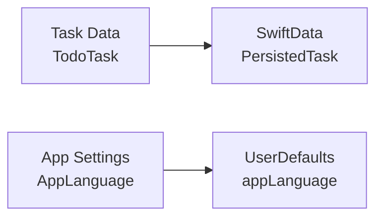
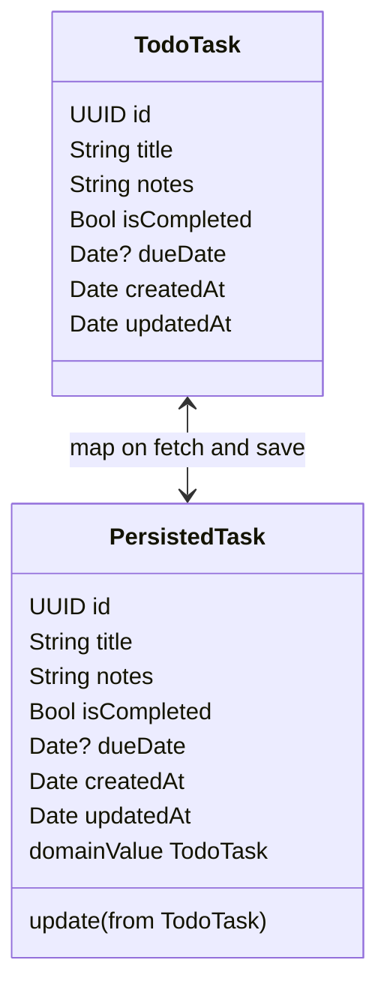
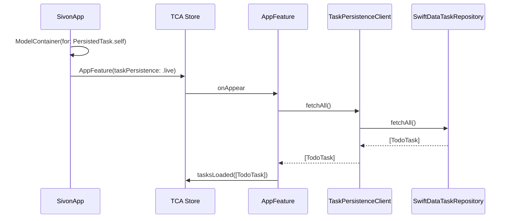
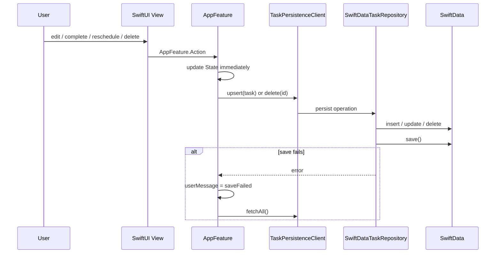
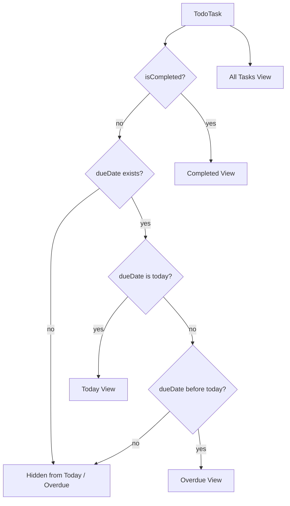

# Sivon Data Storage

## 目的

このドキュメントは、Sivon のデータ保管方針を記録する。対象はタスクデータ、アプリ設定、永続化エラー時の振る舞いである。

## 保存対象

Sivon には現在 2 種類の永続データがある。

| 種類 | 保存先 | 理由 |
| --- | --- | --- |
| タスク | SwiftData | ローカルで構造化されたタスクを永続化し、将来の拡張にも耐えるため。 |
| アプリ言語設定 | UserDefaults | 小さなユーザー設定であり、タスクモデルとは独立しているため。 |

## タスクモデル

ドメイン上のタスクは `TodoTask`、SwiftData 上の保存モデルは `PersistedTask` で表す。

`TodoTask` の主なフィールド:

- `id`: `UUID`
- `title`: タスク名。空文字や空白のみは保存しない。
- `notes`: 補足メモ。現在は空文字を許容する。
- `isCompleted`: 完了状態。
- `dueDate`: 期限日。未設定の場合は `nil`。
- `createdAt`: 作成日時。
- `updatedAt`: 最終更新日時。

`PersistedTask` は SwiftData の `@Model` であり、`id` に `@Attribute(.unique)` を付ける。

## 判断

SwiftData のモデルと TCA の状態は分離する。

理由:

- reducer のテストや状態遷移を SwiftData に依存させない。
- SwiftData の `@Model` は永続化都合の型であり、UI の表示判定やソートとは責務が異なる。
- 将来ストレージを変更する場合も、`TaskPersistenceClient` の実装差し替えで影響範囲を抑えられる。

## 永続化フロー

起動時:

更新時:

UI は操作直後に反映する。保存に失敗した場合は `persistenceFailed` を出し、SwiftData から再読み込みして整合性を戻す。

## 日付の扱い

ビュー判定では時刻を無視し、`Calendar.current.startOfDay(for:)` または `Calendar.isDate(_:inSameDayAs:)` を使う。

重要なルール:

- `today`: `dueDate` が今日、かつ未完了。
- `overdue`: `dueDate` が今日より前、かつ未完了。
- `dueDate == nil`: 今日ビューと期限切れビューには表示しない。
- `completed`: 期限日に関係なく完了済み。

この判定は `TaskDomain.swift` に集約し、view 側で再実装しない。

## アプリ設定

言語設定は `AppLanguage.storageKey` をキーに `UserDefaults` へ保存する。

保存値:

- `system`
- `english`
- `japanese`

`SivonApp` は保存値から `Locale` を導出し、`ContentView` と `SettingsView` に `.environment(\.locale, selectedLanguage.locale)` を渡す。

## 変更時の注意

- タスクのフィールドを追加する場合は `TodoTask` と `PersistedTask` の両方を更新する。
- `PersistedTask.domainValue` と `PersistedTask.update(from:)` の対応漏れを作らない。
- SwiftData migration が必要な変更では、既存ユーザーのローカルデータを壊さない方針を先に決める。
- タスク以外の小さな設定値を安易に `PersistedTask` に追加しない。
