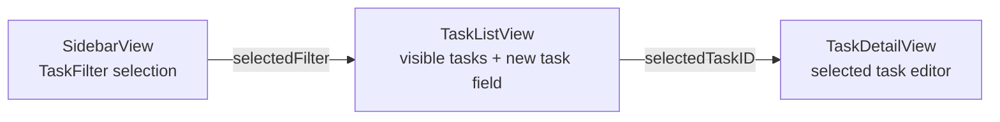
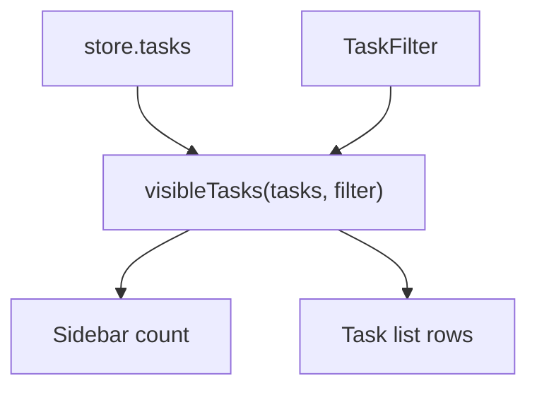
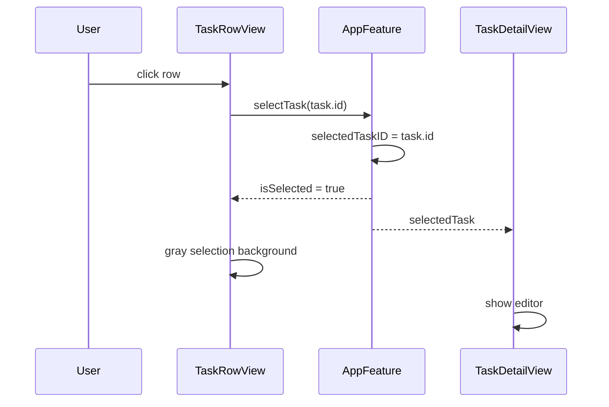
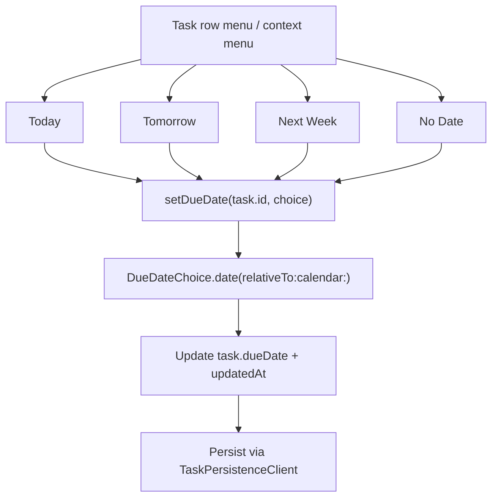
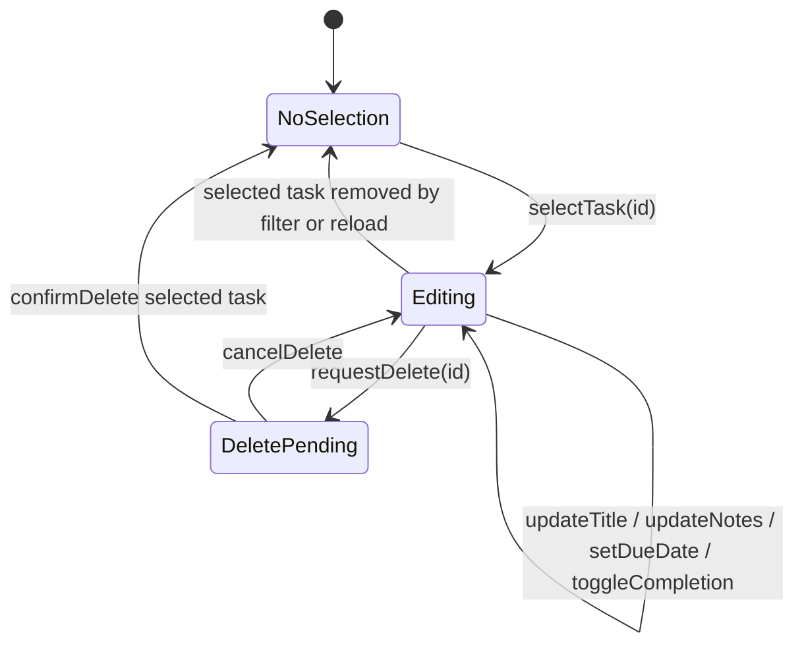

# Sivon UI Logic

## 目的

このドキュメントは、Sivon の UI ロジックと表示判断を記録する。対象は 3 カラム構成、タスク一覧、詳細ペイン、設定画面、選択表示である。

## 全体構成

UI は SwiftUI の `NavigationSplitView` を使う。

各 view は `StoreOf<AppFeature>` を受け取り、ユーザー操作を `AppFeature.Action` として送る。view は永続化やデータ取得を直接行わない。

## サイドバー

`SidebarView` は `TaskFilter.allCases` を表示する。

表示対象:

- Today
- All Tasks
- Overdue
- Completed

件数は `visibleTasks(store.tasks, filter:)` から導出する。件数表示のために別の状態は持たない。

## タスク一覧

`TaskListView` は現在選択中の `selectedFilter` に応じて `store.visibleTasks` を表示する。

一覧上部には新規タスク入力を置く。Enter で `createTaskSubmitted` を送る。

作成時の期限日は以下の通り。

- Today ビュー: 今日の日付。
- その他のビュー: `nil`。

## 選択表示

タスク行の選択は `List(selection:)` を使わず、`selectedTaskID` を TCA state として管理する。

理由:

- macOS 標準の `List(selection:)` は青い選択ハイライトを描画する。
- Sivon のデザインでは、選択中の行は軽いグレー背景だけにする。
- 選択色を標準 List に任せると、詳細ペインの編集状態とデザイン表現を分離しにくい。

現在は `TaskRowView` の `onTapGesture` で `.selectTask(task.id)` を送り、`isSelected` の場合だけ `Color.sivonSelection` を背景に使う。

## タスク行

タスク行は以下を表示する。

- 完了切り替えボタン。
- タイトル。
- 期限日。
- 期限変更メニュー。

期限切れタスクは `isTaskOverdue(_:)` で判定し、日付テキストと枠線に danger 色を使う。完了済みタスクはタイトルを取り消し線と secondary 色で弱める。

## 期限変更

期限変更はタスク一覧の行メニューとコンテキストメニューから行う。

選択肢:

- Today
- Tomorrow
- Next Week
- No Date

詳細ペインには Quick Reschedule 行を置かない。詳細ペインは正確な日付編集と状態編集を担い、素早い再スケジュールは一覧側に寄せる。

## 詳細ペイン

`TaskDetailView` は `selectedTaskID` に対応するタスクがある場合に編集フォームを表示する。選択中タスクがない場合は空状態を表示する。

編集できる項目:

- タイトル。
- 期限日。
- 完了状態。
- メモ。

タイトルが空または空白のみの場合は reducer 側で保存せず、ユーザー向けメッセージを表示する。

## 削除確認

削除は即時実行せず、`deleteCandidateID` を state に保持して `ContentView` の `confirmationDialog` を表示する。

確定時に `confirmDelete` を送り、state から削除してから永続化へ反映する。選択中タスクを削除した場合は `selectedTaskID` を `nil` に戻す。

## 設定画面

`SettingsView` は macOS の Settings scene に表示する。

現在の設定:

- General: 言語設定。
- OSS Licenses: 利用している Swift Package のライセンス表示。

言語設定は `AppLanguage` が `Locale` に変換し、`SivonApp` から view hierarchy に渡す。

## 変更時の注意

- view 側にフィルタ条件やソート条件を重複実装しない。
- タスク行の選択に `List(selection:)` を戻すと青い選択表示が復活するため注意する。
- 詳細ペインに操作を増やす場合は、一覧側の素早い操作と役割が重複しないか確認する。
- 追加した UI 文字列は `Resources/Localizable.xcstrings` に英語・日本語で追加する。
